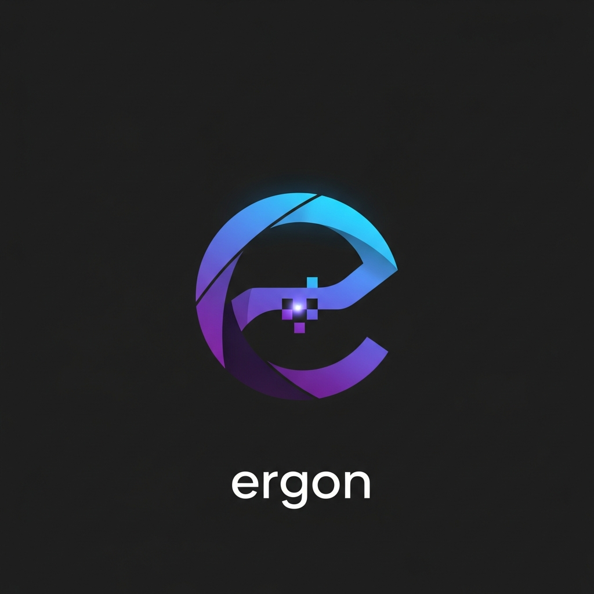

<p align="center">
  
</p>

<h1 align="center">ergon</h1>

<p align="center">
  
  
</p>


AI搭載の画像・動画・音声生成ツール - メディアを理解し、創造する

## Why ergon?

ergonは単なる画像処理ツールではありません。画像・動画・音声とAIの力を組み合わせた多機能CLIツールです：

- **スマートな画像認識** - 画像の内容を自動的に理解し、詳細なキャプションを生成
- **多彩な画像生成** - テキスト入力から10種類以上のスタイルで高品質な画像を作成（Imagen 4）
- **画像編集** - 既存画像をAIで編集・変換（Nano Banana）
- **AI動画生成** - テキストまたは画像から高品質な動画を生成（Veo 3.1）
- **音声合成** - テキストを自然な音声に変換、キャラクター・演技指定も可能（TTS）
- **多言語対応** - 日本語・英語など10言語でのキャプション生成
- **柔軟な出力形式** - Markdown、JSONなど様々な形式に対応

## インストール

### npmからのインストール

```bash
npm install -g @hirokidaichi/ergon
```

### ソースコードからのインストール

```bash
git clone https://github.com/hirokidaichi/ergon.git
cd ergon
npm install
npm run build
npm link
```

### APIキーの設定

`ergon configure`を使って、Google API KEYをセットアップします。

```bash
ergon configure
```

または、環境変数に直接設定することもできます：

```bash
export GOOGLE_API_KEY="your-api-key"
```

## コマンド一覧

```
ergon <command> <subcommand> [options]

Commands:
  image      画像の生成・編集・説明
  video      動画の生成
  narration  音声ナレーションの生成
  preset     画像生成プリセットを管理
  configure  APIキーなどの設定
  log        ログを表示
```

---

## image - 画像コマンド

### image gen - 画像生成（Imagen 4）

テキストから画像を生成します。

```bash
ergon image gen [options] <theme>
```

**オプション：**

| オプション | 説明 | デフォルト |
|-----------|------|----------|
| `-o, --output <path>` | 出力パス | 自動生成 |
| `-s, --size <size>` | サイズ（tiny/hd/fullhd/2k/4k） | fullhd |
| `-a, --aspect-ratio <ratio>` | アスペクト比（16:9/4:3/1:1/9:16/3:4） | 16:9 |
| `-t, --type <type>` | スタイル（下記参照） | flat |
| `-f, --format <format>` | フォーマット（png/jpg/webp） | webp |
| `-e, --engine <engine>` | エンジン（imagen4/imagen4-fast/imagen4-ultra） | imagen4 |
| `-p, --preset <name>` | プリセット名 | - |
| `-c, --context <file>` | コンテキストファイル | - |
| `--json` | JSON形式で出力 | false |
| `--dry-run` | 実行せずに設定確認 | false |

**スタイル（-t）：**
`realistic`, `illustration`, `flat`, `anime`, `watercolor`, `oil-painting`, `pixel-art`, `sketch`, `3d-render`, `corporate`, `minimal`, `pop-art`

**使用例：**

```bash
# 基本的な画像生成
ergon image gen "beautiful sunset over the ocean"

# アニメスタイルで正方形画像
ergon image gen "cute cat character" -t anime -a 1:1

# 高速モードで生成
ergon image gen "mountain landscape" -e imagen4-fast

# プリセットを使用
ergon image gen "product photo" -p corporate-style
```

### image edit - 画像編集（Nano Banana）

既存の画像をAIで編集します。

```bash
ergon image edit [options] <file> <prompt>
```

**オプション：**

| オプション | 説明 | デフォルト |
|-----------|------|----------|
| `-o, --output <path>` | 出力パス | 自動生成 |
| `-f, --format <format>` | フォーマット（png/jpg/webp） | webp |
| `-e, --engine <engine>` | エンジン（nano-banana/nano-banana-pro） | nano-banana |
| `--json` | JSON形式で出力 | false |
| `--dry-run` | 実行せずに設定確認 | false |

**使用例：**

```bash
# 背景を変更
ergon image edit photo.jpg "背景を青空に変更"

# スタイル変換
ergon image edit landscape.png "油絵風にして"

# 要素の削除
ergon image edit photo.jpg "背景の人物を消して" -o edited.jpg
```

### image explain - 画像説明

画像の内容を説明します。

```bash
ergon image explain [options] <file>
```

**オプション：**

| オプション | 説明 | デフォルト |
|-----------|------|----------|
| `-l, --lang <lang>` | 出力言語（ja/en/zh/ko/es/fr/de/it/ru/vi） | ja |
| `-f, --format <format>` | 出力形式（markdown/json） | markdown |
| `-c, --context <context>` | コンテキスト情報 | - |
| `-o, --output <path>` | 出力ファイル | - |

**使用例：**

```bash
# 日本語で説明
ergon image explain photo.jpg

# 英語で説明
ergon image explain photo.jpg -l en

# JSON形式で出力
ergon image explain photo.jpg -f json
```

---

## video - 動画コマンド

### video gen - 動画生成（Veo 3.1）

テキストまたは画像から動画を生成します。

```bash
ergon video gen [options] <theme>
```

**オプション：**

| オプション | 説明 | デフォルト |
|-----------|------|----------|
| `-i, --input <file>` | 入力画像（image-to-video） | - |
| `-o, --output <path>` | 出力パス | 自動生成 |
| `-d, --duration <seconds>` | 動画の長さ（5-8秒） | 8 |
| `-r, --resolution <res>` | 解像度（720p/1080p） | 1080p |
| `-a, --aspect-ratio <ratio>` | アスペクト比（16:9/9:16） | 16:9 |
| `--fast` | 高速モード（Veo 3.1 Fast） | false |
| `--json` | JSON形式で出力 | false |
| `--dry-run` | 実行せずに設定確認 | false |

**使用例：**

```bash
# テキストから動画生成
ergon video gen "a cat playing with a ball"

# 画像から動画生成（image-to-video）
ergon video gen "the character starts dancing" -i character.png

# 縦動画（TikTok/Reels向け）
ergon video gen "person walking in the city" -a 9:16

# 高速モードで生成
ergon video gen "sunset timelapse" --fast
```

---

## narration - 音声コマンド

### narration gen - 音声生成（TTS）

テキストから音声を生成します。キャラクター設定や演技プランも指定可能です。

```bash
ergon narration gen [options] <text>
```

**オプション：**

| オプション | 説明 | デフォルト |
|-----------|------|----------|
| `-o, --output <path>` | 出力パス | 自動生成 |
| `-m, --model <model>` | モデル（pro/flash） | pro |
| `-v, --voice <voice>` | 音声（Aoede/Charon/Fenrir/Kore/Puck） | Kore |
| `-l, --lang <lang>` | 言語（ja/en/zh/ko/es/fr/de/it/pt/ru） | ja |
| `-f, --format <format>` | 形式（mp3/wav） | mp3 |
| `--speed <speed>` | 話速（0.25-4.0） | 1.0 |
| `-c, --character <desc>` | キャラクター設定 | - |
| `-d, --direction <inst>` | 演技プラン | - |
| `--json` | JSON形式で出力 | false |
| `--dry-run` | 実行せずに設定確認 | false |

**使用例：**

```bash
# 基本的な音声生成
ergon narration gen "こんにちは、世界"

# 音声とスピードを変更
ergon narration gen "Hello, world" -v Puck --speed 1.2 -l en

# キャラクター・演技指定
ergon narration gen "えいっ！手裏剣！" -c "元気な女の子" -d "興奮して叫ぶ"

# Flash モデルで高速生成
ergon narration gen "お知らせです" -m flash
```

---

## preset - プリセットコマンド

画像生成のプリセットを管理します。

```bash
# プリセット一覧
ergon preset list

# プリセット作成
ergon preset create <name>

# プリセット削除
ergon preset delete <name>

# プリセット表示
ergon preset show <name>
```

---

## その他のコマンド

### configure - 設定

```bash
ergon configure
```

### log - ログ表示

```bash
ergon log [options]

オプション：
  -n, --number <number>  表示するログ数
  -f, --format <format>  出力形式（text/json）
```

---

## サンプル画像生成例

| スタイル | コマンド | 生成例 |
|---------|---------|--------|
| リアリスティック | `ergon image gen "mountain landscape" -t realistic` |  |
| アニメ | `ergon image gen "cute cat character" -t anime -a 1:1` |  |
| フラット | `ergon image gen "email icon" -t flat -a 1:1` |  |
| 水彩画 | `ergon image gen "spring flowers" -t watercolor -a 1:1` |  |
| ピクセルアート | `ergon image gen "game character" -t pixel-art -a 1:1` |  |
| 3Dレンダリング | `ergon image gen "futuristic building" -t 3d-render -a 1:1` |  |
| コーポレート | `ergon image gen "business meeting" -t corporate` |  |
| ミニマル | `ergon image gen "geometric logo" -t minimal -a 1:1` |  |
| ポップアート | `ergon image gen "woman portrait" -t pop-art -a 1:1` |  |
| スケッチ | `ergon image gen "elderly man portrait" -t sketch -a 1:1` |  |

---

## 設定

### 設定ファイル

```
~/.ergon/config.json
```

### 環境変数

```bash
export GOOGLE_API_KEY="your-api-key"
# または
export GEMINI_API_KEY="your-api-key"
```

### ログファイル

```
~/.ergon/logs/
```

---

## トラブルシューティング

### APIキーが設定されていません

```bash
ergon configure
```

### 動画ダウンロードで403エラー

APIキーが正しく設定されているか確認してください。

### モデルが見つからない

- APIキーが有効か確認
- Google AI Studio でAPIが有効化されているか確認

---

## 開発者向け

```bash
# 開発モード
npm run dev -- <command>

# テスト
npm test

# 型チェック
npm run check

# ビルド
npm run build
```

## ライセンス

MIT

## 作者

Hiroki Daichi
