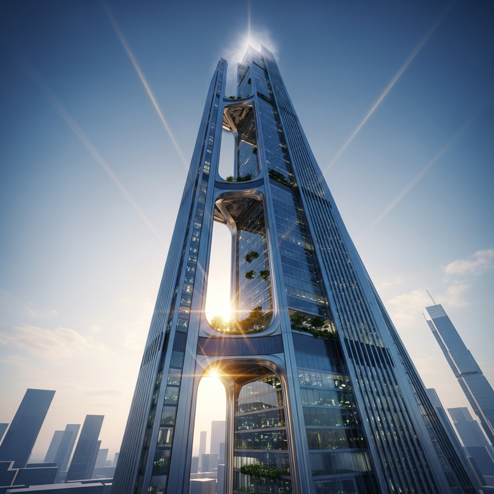
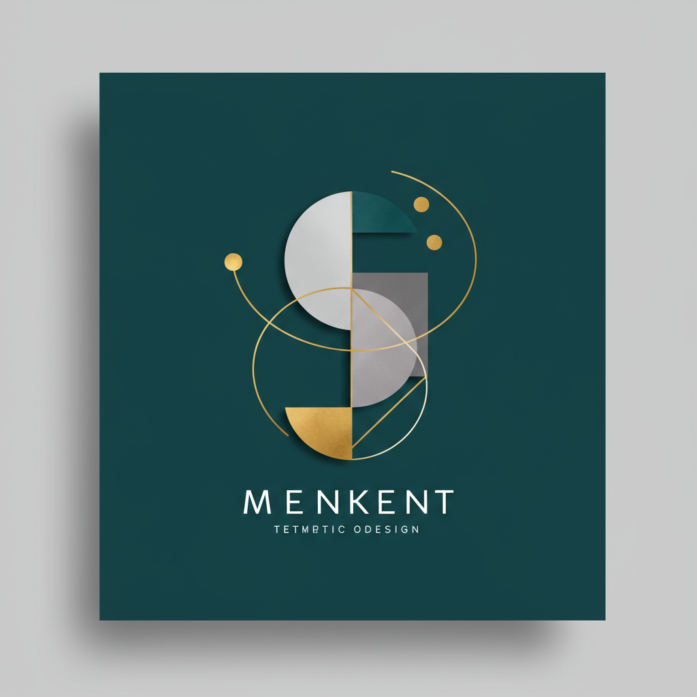
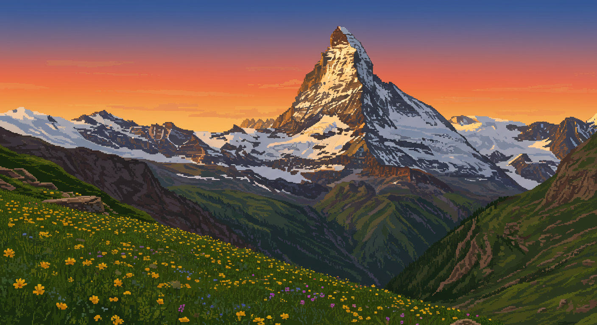

# imark
画像の認識と目録の書き出し

## 概要

imarkは、画像ファイルを自動で認識し、整理された目録を作成するためのCLIツールです。
画像ファイルの内容を解析し、AI Agentの補助をして効率的な管理を可能にします。

## 特徴

- 画像ファイルの自動認識と分類
- AIを活用した画像キャプションの自動生成
- AIを活用した画像生成機能
- 複数言語対応（日本語、英語など）
- 柔軟な出力フォーマット（Markdown、JSON）
- 操作ログの管理と表示

## インストール

以下の2つの方法でインストールできます：

### 1. 直接インストール

```bash
deno install -A -f --name imark https://raw.githubusercontent.com/hirokidaichi/imark/main/src/main.ts
```

### 2. ソースコードからのインストール

```bash
git clone https://github.com/hirokidaichi/imark.git
cd imark
deno task install
```

## 使用方法

### 基本的なコマンド

```bash
# 指定したディレクトリの画像を解析して目録を作成
imark catalog /path/to/images

# 単一画像のキャプションを生成
imark caption image.jpg

# AIを使用して画像を生成
imark gen "画像の説明"

# AIを使用して画像を生成（MCP経由）
imark mcp "画像の説明"

# 操作ログを表示
imark log
```

### コマンドとオプション

#### captionコマンド

単一の画像に対してキャプションを生成します。

```bash
imark caption [options] <image>

オプション：
  -l, --lang <lang>      出力言語（ja: 日本語, en: 英語）
  -f, --format <format>  出力フォーマット（markdown または json）
  -c, --context <context> コンテキスト情報（.mdファイルパスまたはテキスト）
```

#### catalogコマンド

ディレクトリ内の画像を一括でキャプション生成します。

```bash
imark catalog [options] <directory>

オプション：
  -l, --lang <lang>      出力言語（ja: 日本語, en: 英語）
  -f, --format <format>  出力フォーマット（markdown または json）
  -c, --context <context> コンテキスト情報（.mdファイルパスまたはテキスト）
  -o, --output <file>    出力ファイル名（指定がない場合は標準出力）
```

#### genコマンド

AIを使用して画像を生成します。

```bash
imark gen [options] <description>

オプション：
  -s, --size <size>     画像サイズ（hd, fullhd, 2k, 4k）
  -t, --type <type>     画像スタイル（realistic, illustration, flat, anime, watercolor, oil-painting, pixel-art, sketch, 3d-render, corporate, minimal, pop-art）
  -r, --ratio <ratio>   アスペクト比（16:9, 4:3, 1:1, 9:16, 3:4）
  -o, --output <dir>    出力ディレクトリ
```

#### mcpコマンド

MCP経由でAI画像生成を行います。

```bash
imark mcp [options] <description>

オプション：
  -s, --size <size>     画像サイズ（hd, fullhd, 2k, 4k）
  -t, --type <type>     画像スタイル（realistic, illustration, flat, anime, watercolor, oil-painting, pixel-art, sketch, 3d-render, corporate, minimal, pop-art）
  -r, --ratio <ratio>   アスペクト比（16:9, 4:3, 1:1, 9:16, 3:4）
  -o, --output <dir>    出力ディレクトリ
```

#### logコマンド

操作ログを表示します。

```bash
imark log [options]

オプション：
  -n, --number <number> 表示するログの数
  -f, --format <format> 出力フォーマット（text, json）
```

対応している画像形式：
- jpg/jpeg
- png
- gif
- webp
- heic/heif

## サンプル画像生成例

以下は、`imark gen`コマンドを使用して生成できる様々なスタイルの画像例です：

| スタイル | コマンド | 生成例 |
|---------|---------|--------|
| リアリスティック | `imark gen "beautiful mountain landscape with snow peaks" -t realistic -s fullhd --aspect-ratio "16:9"` |  |
| アニメ | `imark gen "cute anime girl with cat ears" -t anime -s fullhd --aspect-ratio "1:1"` |  |
| フラット | `imark gen "simple modern email icon" -t flat -s fullhd --aspect-ratio "1:1"` |  |
| 水彩画 | `imark gen "colorful bouquet of spring flowers" -t watercolor -s fullhd --aspect-ratio "1:1"` |  |
| ピクセルアート | `imark gen "retro style game character" -t pixel-art -s fullhd --aspect-ratio "1:1"` |  |
| 3Dレンダリング | `imark gen "futuristic skyscraper with glass and steel" -t 3d-render -s fullhd --aspect-ratio "1:1"` |  |
| コーポレート | `imark gen "professional business team meeting in modern office" -t corporate -s fullhd --aspect-ratio "16:9"` |  |
| ミニマル | `imark gen "abstract geometric minimal logo design" -t minimal -s fullhd --aspect-ratio "1:1"` |  |
| ポップアート | `imark gen "colorful pop art style portrait of a woman" -t pop-art -s fullhd --aspect-ratio "1:1"` |  |
| スケッチ | `imark gen "pencil sketch portrait of an elderly man" -t sketch -s fullhd --aspect-ratio "1:1"` |  |

各スタイルのオプションを組み合わせることで、様々な用途に合わせた画像を生成できます。
詳細なオプションについては、`imark gen --help`を参照してください。

[サンプル画像の完全なカタログはこちら](samples/catalog.md)をご覧ください。

## キャプション生成サンプル

以下は、`imark caption`コマンドを使用して生成したキャプションの例です：

| 画像 | 日本語キャプション | English Caption |
|------|------------------|-----------------|
|  | 壮大な山脈と、その麓に広がる野花の群生を捉えた風景。中心には雪に覆われた鋭いピークを持つマッターホルンを思わせる山が聳え、夕日の光が山肌を照らし、前景には黄色と紫色の野花が咲き乱れています。 | A breathtaking landscape photograph showcasing a majestic mountain range at sunset, with a snow-capped peak dominating the center, surrounded by vibrant wildflowers in the foreground creating a stunning composition of natural beauty. |

各画像に対して、日本語と英語の両方でキャプションを生成できます。キャプションは画像の内容を詳細に分析し、視覚的な要素や雰囲気を自然な言葉で表現します。

## キャプションを使用した画像生成

キャプションを使用して新しい画像を生成することもできます。既存の画像のキャプションを元に、異なるスタイルで画像を生成する例を示します：

```bash
# 既存の画像からキャプションを生成し、それを元に新しい画像を生成する
imark gen "$(imark caption samples/beautiful-mountain-landscape-snow-peaks-.webp)" --type pixel-art --output samples
```

### 生成例

| 元画像 | 生成画像（ピクセルアート） |
|--------|--------------------------|
|  |  |

このように、キャプションを介して画像の内容を保持しながら、異なる表現スタイルで再生成することができます。

## 開発者向け情報

## ライセンス

MIT

## 作者

Hiroki Daichi
