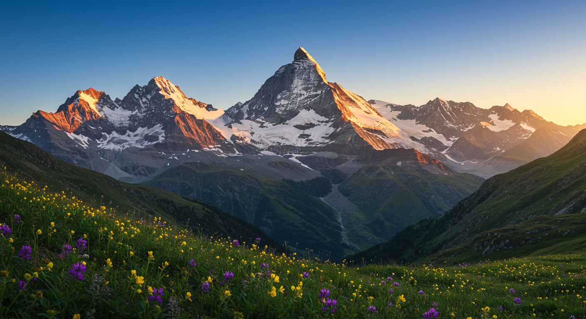

# imark 🖼️✨




AI搭載の画像・動画・音声生成ツール - メディアを理解し、創造する

## Why imark?

imarkは単なる画像処理ツールではありません。画像・動画・音声とAIの力を組み合わせた多機能CLIツールです：

- 🔍 **スマートな画像認識** - 画像の内容を自動的に理解し、詳細なキャプションを生成
- 📚 **整理された画像目録** - 大量の画像を自動で分類・整理
- 🎨 **多彩な画像生成** - テキスト入力から10種類以上のスタイルで高品質な画像を作成
- 🎬 **AI動画生成** - テキストから高品質な動画を生成（Veo 3.1）
- 🔊 **音声合成** - テキストを自然な音声に変換（TTS）
- 🌐 **多言語対応** - 日本語・英語でのキャプション生成
- 📊 **柔軟な出力形式** - Markdown、JSONなど様々な形式に対応

## 概要

imarkは、AIの力を使って画像ファイルを自動認識し、整理された目録を作成するためのCLIツールです。
画像内容の詳細な解析、テキストからの高品質な画像生成、動画生成、音声合成まで、メディア処理のワークフローを効率化します。

## 特徴

- 画像ファイルの自動認識と分類
- AIを活用した画像キャプションの自動生成
- AIを活用した画像生成機能（Imagen 4 / Nano Banana）
- AIを活用した動画生成機能（Veo 3.1）
- AIを活用した音声合成機能（TTS）
- 複数言語対応（日本語、英語など）
- 柔軟な出力フォーマット（Markdown、JSON）
- 操作ログの管理と表示

## インストール

### npmからのインストール

```bash
npm install -g @hirokidaichi/imark
```

### ソースコードからのインストール

```bash
git clone https://github.com/hirokidaichi/imark.git
cd imark
npm install
npm run build
npm link
```

### APIキーの設定

`imark configure`を使って、Google API KEYをセットアップします。

```bash
imark configure
環境変数 GOOGLE_API_KEY が設定されています。
? 環境変数の値を使用しますか？ (y/n) › Yes
設定を保存しました。
```

または、環境変数に直接設定することもできます：

```bash
export GOOGLE_API_KEY="your-api-key"
```

## 使用方法

### コマンド一覧

```
$ imark --help

Usage: imark [command] [options]

AI画像・動画・音声生成ツール

生成コマンド:
  image <theme>     画像を生成 (Imagen 4 / Nano Banana)
  video <theme>     動画を生成 (Veo 3.1)
  audio <text>      音声を生成 (TTS)

分析コマンド:
  explain <file>    画像または音声の内容を説明

ユーティリティ:
  configure         APIキーの設定
  log               ログの表示
```

### 基本的なコマンド

```bash
# 画像の内容を説明
imark explain image.jpg

# 音声の内容を説明
imark explain audio.mp3

# AIを使用して画像を生成 (Imagen 4)
imark image "画像の説明"

# AIを使用して動画を生成 (Veo 3.1)
imark video "動画の説明"

# AIを使用して音声を生成 (TTS)
imark audio "こんにちは、世界"

# 操作ログを表示
imark log
```

### コマンドとオプション

#### explainコマンド

画像または音声ファイルの内容を説明します。

```bash
imark explain [options] <file>

オプション：
  -l, --lang <lang>      出力言語（ja: 日本語, en: 英語, zh: 中国語, ko: 韓国語, 他）
  -f, --format <format>  出力フォーマット（markdown または json）
  -c, --context <context> コンテキスト情報（ファイルパスまたはテキスト）
  -o, --output <path>    出力ファイルパス
```

対応ファイル形式：
- **画像**: jpg, jpeg, png, gif, webp, heic, heif
- **音声**: mp3, wav, flac, aac, ogg, m4a

#### imageコマンド

AIを使用して画像を生成します（Imagen 4 / Nano Banana）。

```bash
imark image [options] <theme>

オプション：
  -i, --input <file>      入力画像（画像編集モード、Nano Banana専用）
  -s, --size <size>       画像サイズ（tiny, hd, fullhd, 2k, 4k）
  -t, --type <type>       画像スタイル（realistic, illustration, flat, anime, watercolor, oil-painting, pixel-art, sketch, 3d-render, corporate, minimal, pop-art）
  -a, --aspect-ratio <ratio>  アスペクト比（16:9, 4:3, 1:1, 9:16, 3:4）
  -f, --format <format>   画像フォーマット（png, jpg, jpeg, webp）
  -e, --engine <engine>   画像生成エンジン（imagen4, imagen4-fast, imagen4-ultra, nano-banana, nano-banana-pro）
  -o, --output <path>     出力パス（ファイルまたはディレクトリ）
  -d, --debug             デバッグモード
```

##### 画像編集モード（Nano Banana専用）

`--input` オプションを使用すると、既存の画像を編集できます：

```bash
# 画像を白黒に変換
imark image "白黒にして" -i photo.jpg -e nano-banana

# 画像のスタイルを変更
imark image "油絵風にして" -i landscape.png -e nano-banana

# 画像から要素を削除
imark image "背景の人物を消して" -i photo.jpg -e nano-banana -o edited.jpg
```

> **Note:** 画像編集モードは Nano Banana エンジン（`-e nano-banana` または `-e nano-banana-pro`）でのみ利用可能です。

#### videoコマンド

AIを使用して動画を生成します（Veo 3.1）。

```bash
imark video [options] <theme>

オプション：
  -d, --duration <seconds>  動画の長さ（5-8秒）
  -r, --resolution <res>    解像度（720p, 1080p）
  -a, --aspect-ratio <ratio>  アスペクト比（16:9, 9:16）
  --fast                    高速モード（Veo 3.1 Fast を使用）
  -o, --output <path>       出力パス
  --debug                   デバッグモード
```

#### audioコマンド

AIを使用して音声を生成します（TTS）。

```bash
imark audio [options] <text>

オプション：
  -o, --output <path>     出力パス（ファイルまたはディレクトリ）
  -v, --voice <voice>     音声（Aoede, Charon, Fenrir, Kore, Puck）
  -l, --lang <lang>       言語（ja, en, zh, ko, es, fr, de, it, pt, ru）
  -f, --format <format>   形式（mp3, wav）デフォルト: mp3
  --speed <speed>         話速（0.25-4.0）デフォルト: 1.0
  --debug                 デバッグモード
```

#### logコマンド

操作ログを表示します。

```bash
imark log [options]

オプション：
  -n, --number <number> 表示するログの数
  -f, --format <format> 出力フォーマット（text, json）
```

対応している画像形式：
- jpg/jpeg
- png
- gif
- webp
- heic/heif

## サンプル画像生成例

以下は、`imark image`コマンドを使用して生成できる様々なスタイルの画像例です：

| スタイル | コマンド | 生成例 |
|---------|---------|--------|
| リアリスティック | `imark image "beautiful mountain landscape with snow peaks" -t realistic -s fullhd -a "16:9"` |  |
| アニメ | `imark image "cute anime girl with cat ears" -t anime -s fullhd -a "1:1"` |  |
| フラット | `imark image "simple modern email icon" -t flat -s fullhd -a "1:1"` |  |
| 水彩画 | `imark image "colorful bouquet of spring flowers" -t watercolor -s fullhd -a "1:1"` |  |
| ピクセルアート | `imark image "retro style game character" -t pixel-art -s fullhd -a "1:1"` |  |
| 3Dレンダリング | `imark image "futuristic skyscraper with glass and steel" -t 3d-render -s fullhd -a "1:1"` |  |
| コーポレート | `imark image "professional business team meeting in modern office" -t corporate -s fullhd -a "16:9"` |  |
| ミニマル | `imark image "abstract geometric minimal logo design" -t minimal -s fullhd -a "1:1"` |  |
| ポップアート | `imark image "colorful pop art style portrait of a woman" -t pop-art -s fullhd -a "1:1"` |  |
| スケッム| `imark image "pencil sketch portrait of an elderly man" -t sketch -s fullhd -a "1:1"` |  |

各スタイルのオプションを組み合わせることで、様々な用途に合わせた画像を生成できます。
詳細なオプションについては、`imark image --help`を参照してください。

[サンプル画像の完全なカタログはこちら](samples/catalog.md)をご覧ください。

## 説明生成サンプル

以下は、`imark explain`コマンドを使用して生成した説明の例です：

| 画像 | 日本語キャプション | English Caption |
|------|------------------|-----------------|
|  | 壮大な山脈と、その麓に広がる野花の群生を捉えた風景。中心には雪に覆われた鋭いピークを持つマッターホルンを思わせる山が聳え、夕日の光が山肌を照らし、前景には黄色と紫色の野花が咲き乱れています。 | A breathtaking landscape photograph showcasing a majestic mountain range at sunset, with a snow-capped peak dominating the center, surrounded by vibrant wildflowers in the foreground creating a stunning composition of natural beauty. |

各画像に対して、日本語と英語の両方でキャプションを生成できます。キャプションは画像の内容を詳細に分析し、視覚的な要素や雰囲気を自然な言葉で表現します。

## 説明を使用した画像生成

説明を使用して新しい画像を生成することもできます。既存の画像の説明を元に、異なるスタイルで画像を生成する例を示します：

```bash
# 既存の画像から説明を生成し、それを元に新しい画像を生成する
imark image "$(imark explain samples/beautiful-mountain-landscape-snow-peaks-.webp)" -t pixel-art -o samples
```

### 生成例

| 元画像 | 生成画像（ピクセルアート） |
|--------|--------------------------|
|  |  |

このように、キャプションを介して画像の内容を保持しながら、異なる表現スタイルで再生成することができます。

## 設定とログ

### 設定ファイル

imarkの設定は以下の場所に保存されます：

```
~/.imark/config.json
```

設定ファイルの内容：
```json
{
  "apiKey": "your-google-api-key"
}
```

### 環境変数

APIキーは環境変数でも設定できます（設定ファイルより優先）：

```bash
export GOOGLE_API_KEY="your-api-key"
# または
export GEMINI_API_KEY="your-api-key"
```

### ログファイル

操作ログは以下の場所に保存されます：

```
~/.imark/logs/
```

ログは `imark log` コマンドで確認できます。

## トラブルシューティング

### APIキーが設定されていません

```
エラー: GOOGLE_API_KEYが設定されていません
```

**解決方法:**
1. `imark configure` を実行してAPIキーを設定
2. または環境変数 `GOOGLE_API_KEY` を設定

### 画像編集モードでエラー

```
画像編集モードではNano Bananaエンジンを使用してください
```

**解決方法:**
画像編集（`--input` オプション）は Nano Banana でのみ利用可能です：
```bash
imark image "編集内容" -i input.jpg -e nano-banana
```

### モデルが見つからない

```
models/xxx is not found
```

**解決方法:**
- APIキーが有効か確認
- Google AI Studio でAPIが有効化されているか確認
- 利用可能なモデルはリージョンによって異なる場合があります

## 開発者向け情報

```bash
# 開発モードで実行
npm run dev -- <command>

# テスト実行
npm test

# 型チェック
npm run check

# ビルド
npm run build
```

## ライセンス

MIT

## 作者

Hiroki Daichi
