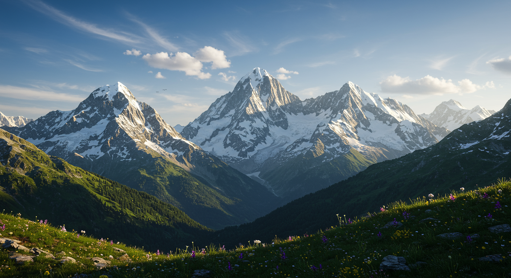
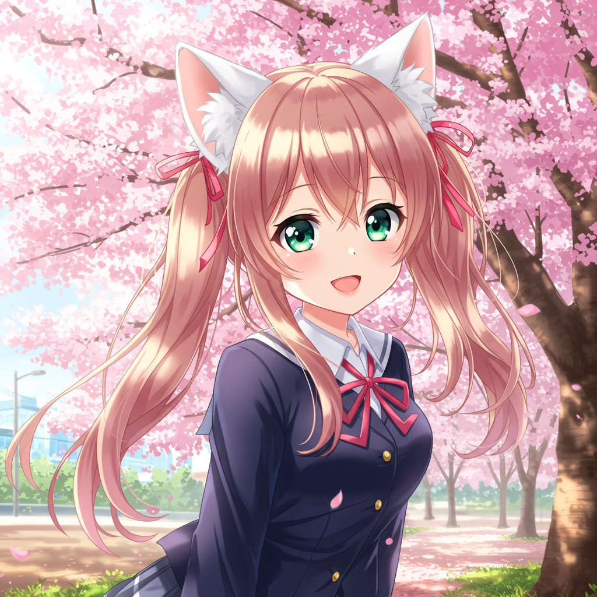

---

# samples/beautiful-mountain-landscape-snow-peaks-.png

画像は、夕日に照らされた壮大な山岳風景を描いています。前景は、色とりどりの高山植物が咲き乱れる緑豊かな斜面で構成されています。斜面は、豊かな緑と点在する岩で構成され、奥へと続く山々へと緩やかに傾斜しています。

背景には、複数の雪に覆われた山々がそびえ立っており、その中心には最も高く、最も目立つピークがあります。これらの山々は、険しい岩肌と、まだ残雪が残る谷や斜面を持つ複雑な地形を示しています。雪の白さと山の灰色の岩肌のコントラストが、ドラマチックな視覚効果を生み出しています。

空は、晴れ渡った青色で、雲がまばらに浮かび、夕焼けが柔らかな光を山々にもたらしています。空の明るさと、山々によって投げかけられる影の深さとのコントラストが、画像の全体的な雰囲気を強調しています。全体として、この画像は、自然の壮大さと美しさを捉えた静かで雄大なシーンです。山々の規模と、前景の野花畑との対比が、見る者に畏敬の念と平和感を呼び起こします。高山の環境に特有の静寂と穏やかさが感じられます。画像全体の色彩は、緑、青、白の自然なパレットで、夕暮れの暖色の微妙なタッチが加えられています。これは、質の高い風景写真やデジタルアートであり、自然愛好家や芸術愛好家に訴求するものです。

---

# samples/colorful-pop-art-portrait-of-a-woman.webp

この画像は、ポップアートスタイルで描かれた女性のポートレートです。

**特徴:**

* **スタイル:** 画像は、鮮やかな色使いと点描（ベンデッド・ドット）技法を用いた、1960年代のアメリカン・ポップアートを彷彿とさせるスタイルで描かれています。特にアンディ・ウォーホル風の色彩と表現が見られます。
* **人物:** ポートレートの中心人物は、濃いピンクがかった紫色の長い巻き毛を持つ女性です。肌の色は黄緑色で、白い歯を見せて笑顔を浮かべています。大きなゴールドのフープイヤリングをしています。彼女の表情は明るく、自信に満ち溢れて見えます。
* **背景:** 背景は、ターコイズブルーと濃いマゼンタピンクの2色で構成され、それぞれドットパターンで表現されています。色のコントラストが、女性の鮮やかな髪色と肌の色を際立たせています。
* **ディテール:** 髪の毛のウェーブ、肌の質感、そして明るい笑顔など、細部まで丁寧に描かれており、リアルな描写とポップアートのスタイルの融合が見られます。

**全体的な印象:**

この画像は、大胆な色使いとレトロなスタイルが魅力的な、力強くポジティブな印象を与えます。女性の美しさや魅力を強調しており、グラフィックデザインや広告素材としても活用できる可能性があります。  明るく、エネルギーに満ちた雰囲気でありながら、どこかノスタルジックな雰囲気も感じさせます。

---

# samples/abstract-geometric-minimal-logo-design.webp

この画像は、深緑色の背景に幾何学的なデザインが施されたロゴまたはブランドマークを特徴としています。

デザインの中心には、白、グレー、緑の幾何学的な形状が配置されています。これらの形状は、円、半円、正方形など様々な形をしており、重なり合って複雑なパターンを作り出しています。形状は金色で縁取られた線のネットワークで繋がれており、全体に洗練された、幾何学的なバランスが感じられます。金のアクセントは、ロゴに高級感と現代的な感触を与えています。

背景は深く鮮やかな深緑色で、幾何学的なデザインとのコントラストが鮮やかです。深緑色は、落ち着きと高級感を強調し、金の要素と調和しています。

デザインの下部には、"MENKENT"というテキストがロゴの書体で書かれており、その下に "TETMPTIC ODESIGN" と書かれています。これは、おそらくブランド名とブランドのキャッチコピーまたは説明を示していると思われます。"TETMPTIC ODESIGN"は、綴りが意図的に変わっているか、またはタイポグラフィックな表現である可能性があります。

全体として、このロゴデザインは洗練されていて、現代的な美的感覚を示しています。幾何学的なパターンと色の組み合わせは、洗練されていてミニマルな美学を追求しており、様々なブランドや企業に適応できる汎用性があります。特に、高級感やモダンさを求めるブランドにとって最適なデザインと言えるでしょう。

---

# samples/cute-anime-girl-with-cat-ears-school-uni.png

この画像は、桜が満開の春の情景の中で、アニメ風の少女を描いたものです。

**少女の特徴:**

* **髪型:** 肩まで届く長さのブロンドがかった茶色の髪を、ツインテールに結んでいます。髪留めは赤いリボンを使用しています。髪は柔らかく、風になびいているような表現がされています。
* **服装:** ダークネイビーのセーラー服を着ています。白い襟と赤いリボンがアクセントになっています。セーラー服の下に白いシャツを着ているのが見えます。
* **アクセサリー:** 白くてふわふわした猫耳カチューシャをつけています。
* **顔:** 大きくて緑色の目が特徴的で、頬はほんのり紅潮しています。笑顔で、明るい表情をしています。肌は滑らかで、透明感があります。

**背景の特徴:**

* **桜:** 背景は満開の桜並木です。ピンク色の桜の花びらがたくさん散っており、春の暖かさを感じさせる描写です。桜の木々は、奥に向かって伸びており、奥行きが表現されています。
* **場所:** 桜並木の遊歩道のような場所です。遠くに建物らしきものが見えますが、詳細な描写はありません。地面には、桜の花びらが散っています。緑色の芝生も確認できます。

**全体的な印象:**

全体として、可愛らしく明るい雰囲気のイラストです。少女の表情や、桜の美しい描写が相まって、見ている人を幸せな気持ちにさせるような、暖かく優しい印象を与えます。アニメや漫画、ゲームなどのキャラクターデザインとして使われそうな、典型的な「可愛い女の子」のイラストレーションと言えます。イラストの技術的にも高いクオリティを感じさせます。色使いが鮮やかで、少女と背景の調和も取れています。

---

# samples/simple-modern-email-icon.webp

この画像は、新しいメッセージを受信したことを示す、スタイリッシュなフラットデザインのメールアイコンです。

具体的には、以下の特徴があります。

* **メールの封筒:** 淡いミントグリーンの封筒が中心に描かれています。封筒の線は濃い青色で、シンプルながらも洗練された印象です。封筒の形状は、一般的なメールアイコンのデザインに沿ったもので、分かりやすくなっています。
* **通知バッジ:** 封筒の右上に、小さなピンク色の正方形のバッジが配置されています。これは、未読のメッセージがあることを示す一般的な通知アイコンのデザインです。数字ではなく、単純な形状で表現することで、ミニマルで洗練された印象を与えています。
* **背景の装飾:** 封筒の周囲には、淡い色合いの青、ピンク、緑の小さな円が散らばっています。これらの円は、軽やかで遊び心のある雰囲気を作り出し、アイコン全体をより魅力的にしています。これらの円は、ランダムに配置されており、固定的ではなく、動きを感じさせる効果もあります。
* **全体的なスタイル:** アイコン全体は、フラットデザインと線画を組み合わせた、現代的でミニマルなスタイルです。色使いも優しく、視覚的に心地よい印象を与えます。

このアイコンは、メールアプリ、ウェブサイト、またはその他のデジタル製品で使用できる、視覚的に魅力的で分かりやすいデザインです。新しいメッセージの通知を伝えるだけでなく、アプリやサービス全体のデザインに調和する、洗練された視覚的要素としても機能します。

---

# samples/professional-business-team-meeting-offic.webp

はい、画像について説明します。

画像は、モダンで日当たりの良いオフィス会議室で、多様な人種のビジネスグループが会議をしている様子を写したものです。会議室は大きく、窓から自然光が差し込んでおり、都会の景色が見えます。

会議室には、木製の大きな長方形の会議テーブルがあり、その周りに6人が座っています。そのうち4人は会議に参加しており、2人は立ちながら会議をリードしています。

会議に参加している4人は、男性2人と女性2人で、全員がプロフェッショナルな服装をしています。それぞれがノートパソコンかタブレット端末を持っており、真剣な表情で議論に参加している様子が見て取れます。

会議をリードしている2人は、1人は男性でダークスーツを着てタブレット端末を持っており、もう1人は女性で明るい色のスーツを着ています。彼らは会議の進行役として、参加者に指示を出したり、資料を示したりしているようです。

会議室には、観葉植物がいくつか配置され、温かく、親しみやすい雰囲気を醸し出しています。全体的な雰囲気は、プロフェッショナルでありながらもリラックスしていて、活気のある会議が行われている様子を表しています。

画像の構成は、会議テーブルを中心として、参加者たちがバランス良く配置されています。自然光と室内照明の組み合わせが、画像に深みを与えています。

この画像は、多様性のあるチーム、現代的な職場環境、効果的な会議の様子などを象徴的に示していると言えるでしょう。

---

# samples/pencil-sketch-portrait-of-an-elderly-man.webp

これは鉛筆画で描かれた、高齢の男性の肖像画です。

**特徴:**

* **人物描写:** 男性は高齢で、顔には深い皺やシワが刻まれています。これは年齢を重ねた人生の証であり、人物の重厚感や歴史を感じさせます。額や頬、目の周りには特に多くの皺があり、皮膚の質感も細やかに表現されています。目は穏やかで、経験豊かさを暗示しています。口元は控えめな微笑みを浮かべており、全体として優しい印象を与えます。髪は薄く、後退しており、これもまた年齢を重ねたことを示唆しています。男性の首は年齢とともに皮膚がたるんでいる様子が表現されています。

* **画法:** 作品は鉛筆画で、濃淡を巧みに使い分けて人物の立体感や陰影を表現しています。特に、肌の質感、髪の毛の表現、服の質感が繊細に描かれています。線の強弱や方向によって、髪の毛の流れや肌の凹凸がリアルに表現されています。背景はハッチング（平行線）で陰影をつけ、人物を際立たせています。

* **構図:** 男性はバストアップで描かれており、正面からやや斜めに見つめる視線は、見る者に語りかけているかのようです。構図はシンプルながらも、人物の表情や仕草が効果的に表現されています。

* **全体的な印象:** 全体として、この肖像画は高齢の男性の深い人生経験と穏やかな性格を繊細に表現した、力作と言えます。作者の優れた観察力と描写力が感じられ、静謐で、かつ力強い印象を与えます。絵には2016年と作者と思われる署名「KAVAAREN」も記されています。

この鉛筆画は、人物の肖像を写実的に描く技術の高さを示すだけでなく、老いてなお穏やかさを保つ人物の人間性をも伝える、非常に洗練された作品です。

---

# samples/cute-anime-girl-with-cat-ears.webp

この画像は、アニメスタイルの若い女性を描いています。彼女は明るい金色のツインテールヘアスタイルをしており、猫耳のヘアアクセサリーをつけています。彼女の目は大きく、鮮やかな緑色で、優しい表情をしています。彼女は淡いピンク色の、フリルのついた可愛いワンピースを着ており、胸元には小さなリボンが飾られています。白いニーハイソックスとピンク色の靴を履いています。

背景は、満開の桜並木で、春らしい、暖かく穏やかな雰囲気を作り出しています。桜の花びらが風に乗って舞い落ちており、全体に柔らかな光が差し込んでいます。彼女は、桜並木の中、緑の芝生の上に立っており、絵全体に幸せで可愛らしい雰囲気が溢れています。

このイラストは、日本のアニメや漫画の美学に強く影響を受けており、特徴的な大きな目、鮮やかな色使い、可愛らしいキャラクターデザインなどが見て取れます。全体として、見ている人を幸せな気持ちにさせる、非常に魅力的で愛らしいイラストと言えるでしょう。

---

# samples/matterhorn-sunset-swiss-alps-landscape-h.webp

この画像は、ピクセルアートスタイルで描かれたスイスのアルプス山脈の夕景です。中心には、マッターホルン（Cervin）が雄大にそびえ立っています。

**マッターホルン:**  画像の焦点であり、特徴的なピラミッド型の山容が、夕焼け空を背景に際立って見えます。雪に覆われた山頂と、岩肌が露出した部分のコントラストが鮮やかです。太陽の光が山肌に当たって、黄金色に輝いている様子が表現されています。

**山岳地帯:** マッターホルンを取り囲む山々は、同様に雪をかぶり、深い谷と険しい斜面が連なっています。これらの山々は、マッターホルンよりも低く、規模は様々ですが、全体として壮大な山塊を形成しています。色彩は、山の高さや日照によって変化し、深い緑、茶色、そして雪の白が混ざり合っています。夕焼けの色合いが山々に反射し、オレンジやピンクの色調が山肌を彩っています。

**前景:** 山腹の斜面には、黄色い花が一面に咲く野原が広がっています。おそらく高山植物でしょう。花の色と緑の草とのコントラストが美しく、山岳景観の穏やかな一面を見せています。紫色の小さな花も点在しており、彩りを添えています。岩が点在する場所もあり、自然の荒々しさと花の美しさの共存が感じられます。

**空:** 夕焼け空は、オレンジ色から濃い青色へとグラデーションがかかっており、日の入り間近の情景が効果的に表現されています。空の色彩は、山々の色調と調和し、全体として暖色系の落ち着いた雰囲気を作り出しています。

**全体として:** この画像は、ピクセルアートの独特の表現技法を用いながらも、スイスアルプスの壮大さと美しさを忠実に再現しています。夕焼けの光と、花畑とマッターホルンの組み合わせは、静かで美しい、そして畏敬の念を抱かせるような情景を描き出しています。  ピクセルアート特有のブロック状の表現は、むしろ絵画的な効果を生み出し、独特の雰囲気を醸し出しています。

---

# samples/retro-style-game-character.webp

この画像は、ピクセルアートで描かれた、夜に森の中で剣を持つ若い男性のキャラクターを表しています。

**キャラクター:**

* **外見:** 男性は茶色の髪と青い長袖のチュニックを着ています。チュニックは腰にベルトで留められており、茶色の革の手袋とブーツを履いています。肩には青色のマントのような布が垂れ下がっています。彼の顔はシンプルで、やや子供っぽい印象を与えています。
* **装備:** 男性は光る刃を持つ剣を持っています。剣の刃は明るく輝いており、周囲を照らしています。これは魔法の剣または特別な能力を持つ剣であることを示唆しています。彼は戦闘の準備をしているか、または冒険の途中でいるように見えます。

**背景:**

* **環境:** キャラクターは暗く、深い紫色の夜空の下、暗い森の中にいます。木々はシルエットとして描かれており、詳細な描写はありません。空には小さな白い星が散らばっています。地面は暗い紫と茶色で、草や低木がわずかに描かれています。全体的な雰囲気は静かで、少し不気味で神秘的です。
* **照明:** 光源は主に剣の刃からの光です。この光がキャラクターと周囲の小さな部分を照らし、暗闇とのコントラストを生み出しています。

**スタイル:**

* **ピクセルアート:** 画像全体はピクセルアートのスタイルで描かれており、レトロなビデオゲームを連想させます。ピクセルは比較的大きく、明確に区別されており、ノスタルジックな雰囲気を作り出しています。

**全体的な印象:**

この画像は、ロールプレイングゲーム（RPG）やアドベンチャーゲームのキャラクターやシーンを彷彿とさせます。静かな夜に冒険に出かける、または魔法の力を持つ剣を携えた若い主人公の物語の一場面を描写しているように見えます。色彩、雰囲気、キャラクターデザインは、このイメージにレトロな魅力とファンタジー要素を与えています。

---

# samples/beautiful-mountain-landscape-snow-peaks-.webp

この画像は、夕焼けに染まる雄大な山脈と、その前方に広がる野花畑の美しい景色を捉えています。

**山脈:**

画像の中央に堂々とそびえ立つのは、雪をかぶった鋭い峰を持つ山々です。その中でも特に目立つのは、ピラミッド状の頂上を持つ、マッターホルンを思わせる特徴的な山です。この山は、夕日に照らされ、黄金色に輝いています。山肌には、雪渓や氷河と思われる白い部分と、岩肌の露出した茶褐色の部分が見られます。山々は連なり、奥行きのある壮大な景色を作り出しています。山々の輪郭は鮮明で、それぞれの峰の形状がはっきりと見えます。全体的な色調は、夕焼けの影響で暖色系が強く、オレンジや金色が山々に映えています。

**野花畑:**

山々の麓には、一面に野花が咲き乱れる草原が広がっています。黄色い花が主体で、紫色の花が点在し、色彩豊かなコントラストを見せています。花の種類は様々で、密集して咲いている様子から、豊かな自然が感じられます。花畑は前景に広がり、写真全体に奥行きを与えています。花の色合いは、山々の色調と調和しており、自然の穏やかで美しい雰囲気を作り出しています。

**全体的な印象:**

この画像は、自然の壮大さと美しさを完璧に表現した、まさに絶景写真です。夕焼けの光、雪を冠した山々、そして鮮やかな野花畑の組み合わせは、見る者に深い感動を与えます。高画質で、細部まで鮮明に描写されており、山々の質感や花の繊細さを感じることができます。まるで絵画のような、理想的な自然風景が写し出されています。場所としては、スイスアルプスのような高山の風景が想像されます。 全体として、静寂で平和な雰囲気を感じさせる、息を呑むような素晴らしい一枚です。

---

# samples/simple-email-icon-modern-style.png

この画像は、シンプルでスタイリッシュな封筒のイラストです。

**詳細:**

* **封筒のデザイン:** 封筒は、青みがかった灰色（スレートグレーのような色）の細い線で描かれたアウトラインで表現されています。封筒は簡略化されたデザインで、詳細な装飾や影はありません。フラップ部分は滑らかに曲線で描かれ、全体としてミニマルでクリーンな印象を与えています。

* **背景と装飾:** 白地に配置されており、封筒の周囲には淡いピンク、水色、ミントグリーンの小さな円や点が散りばめられています。これらの点は、ランダムに配置され、軽やかで遊び心のある雰囲気を演出しています。点は、水彩絵の具で描いたような柔らかな質感で、全体の色合いに統一感を与えています。

* **全体的な印象:** 全体として、この画像はシンプルながらも洗練されたデザインで、メール、メッセージ、通信といった概念を視覚的に表現しています。明るく、清潔で、親しみやすい雰囲気であり、ウェブサイト、アプリ、またはその他のデジタルコンテンツにおけるアイコンやグラフィック要素として使用されることを意図しているように見えます。  ミニマリストのデザインが好まれる現代のデザイントレンドに合致しています。

**用途:**

この画像は、電子メール、メッセージング、コミュニケーションアプリ、ウェブサイト、ブログ、ソーシャルメディア、その他のデジタルコンテンツで使用することができます。シンプルで分かりやすいアイコンとして、メール送信や受信、メッセージ通知などの機能を表現するのに最適です。

---

# samples/futuristic-skyscraper-glass-steel.webp

画像は、夕暮れの美しい光を浴びた超高層ビルの詳細なレンダリングです。建物は、現代的で幾何学的なデザインが特徴です。

**建物の特徴:**

* **構造:** 建物は、複雑で大胆な幾何学的な外骨格構造をしています。黒い鋼鉄製の梁と支柱がガラスのファサードを支え、独特のダイヤモンド型または三角形の模様を作り出しています。この構造は、ビルの内部空間を仕切るだけでなく、建築上の特徴として視覚的な興味も加えています。

* **ファサード:** 外壁は、大部分が床から天井まで続く大きなガラス窓で構成されています。夕日の光がガラスに反射し、暖色系の金色の輝きを生み出しています。ガラスの透過性により、内部の照明が透けて見え、活気のあるオフィス空間が垣間見えます。

* **緑化:** ビルのいくつかの階には、緑の植生が見られます。これは、屋上庭園やバルコニーに配置された植木鉢、または統合された緑化システムを示唆しています。これは、現代建築における持続可能性と自然との調和というトレンドを表しています。

* **照明:** 夕暮れの時間帯のため、建物の内部の照明が強く強調されています。各階は、個々の部屋やオフィスを示唆する光点を多数示しています。これは、活気のある都市環境での機能的な建物であることを示唆しています。

* **スタイル:** 全体的なスタイルは、現代的で未来的なもので、大胆な幾何学的なデザインと持続可能な建築要素を組み合わせています。

**背景:**

画像の背景には、遠くにぼやけた都市のスカイラインが見えます。この背景は、建物の規模と都市環境におけるその存在感を強調しています。夕焼け空の色合は、全体の雰囲気に温かみとドラマチックな要素を加えています。

**全体的な印象:**

この画像は、建築、デザイン、テクノロジーの高度な融合を象徴する、視覚的に魅力的なものです。この超高層ビルは、技術革新、持続可能性、都市空間における現代建築の美学を示しています。画像は、高品質のデジタルレンダリングであり、詳細なディテールとリアルな照明により、非常に現実的な描写を実現しています。

---

# samples/colorful-bouquet-of-spring-flowers.webp

この水彩画は、鮮やかなオレンジ色のチューリップ2輪、明るい黄色のラッパズイセン2輪、そして紫色のヒヤシンス4輪を写実的に描いた作品です。

それぞれの植物は、細部まで丁寧に描かれており、花びらの質感や葉の繊細な陰影が感じられます。チューリップのオレンジ色は暖かく、ラッパズイセンの黄色は明るく、ヒヤシンスの紫色は落ち着いた雰囲気を醸し出しています。

花々は、緑色の葉とともに束ねられており、全体として春らしい、生命力に満ちた印象を与えます。背景は、淡い水彩のタッチで描かれたオレンジ色、黄色、青色のグラデーションで、花々の色彩を引き立てています。背景の不規則な色ムラは、水彩画独特の柔らかく、自然な雰囲気を作り出しています。

全体として、この水彩画は、花々の美しさ、水彩画の繊細な表現力、そして春の訪れを鮮やかに表現した、美しい作品です。観る者に春の訪れを告げる、明るくポジティブな気持ちにさせてくれるでしょう。

